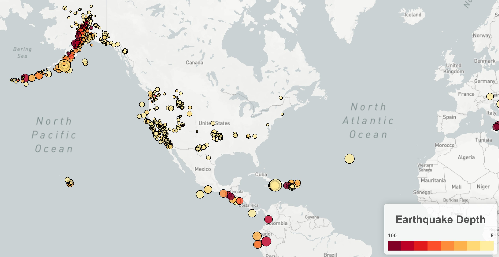

# Leaflet Earthquake Map

World map generated by Leaflet with earthquakes plotted from the United States Geological Survey (USGS) based on their longitude and latitude. Data markers reflect the magnitude of the earthquake by size, and depth by color. Earthquakes with higher magnitudes appear larger and earthquakes with greater depth appear darker in color. Includes popups that provide additional information about the earthquake when a marker is clicked.

## Map Visualization

## Data Source

- [United States Geological Survey (USGS) Earthquake GeoJSON Summary Format](https://earthquake.usgs.gov/earthquakes/feed/v1.0/geojson.php)

## Authors

- **David W. Mueller**
  - [LinkedIn Profile](https://www.linkedin.com/in/davidwaltermueller/)
  - davemuelle@gmail.com

## Acknowledgments

- Michigan State University Data Analytics Boot Camp; July 21, 2021.
